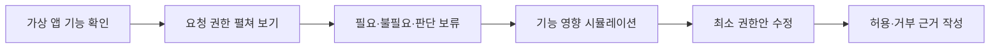

# Minimum Permission Lab

> 한국어 서비스명: **앱 권한 최소허용 연구소**  
> 문서 상태: 설계 확정 전 검토본 · 구현하지 않음  
> 작성일: 2026-08-26

## 1. 프로젝트 개요

| 항목 | 설계 내용 |
|---|---|
| 대상 | 초등 5~6학년 |
| 교과 | 실과·도덕·디지털 시민성 |
| 핵심 질문 | 앱의 기능을 쓰는 데 정말 필요한 권한은 무엇이며, 왜 그만큼만 허용해야 할까요? |
| 한 차시 권장 시간 | 30~40분 |
| 실행 형태 | 실제 기기 권한을 요청하지 않는 정적 시뮬레이션 |
| 핵심 산출물 | 기능별 최소 권한표와 허용·거부 근거 |

학생은 가상의 앱이 요청하는 카메라·마이크·위치·연락처 권한을 살펴보고, 기능 설명과 비교하여 **필요한 권한만 선택적으로 허용**합니다. 권한을 무조건 거부하는 활동이 아니라 목적, 사용 시점, 대안, 철회 가능성을 함께 판단하는 디지털 시민성 학습입니다.

## 2. 핵심 설계 원칙

- 실제 브라우저나 운영체제의 권한 API를 호출하지 않습니다.
- 특정 회사·운영체제의 실제 화면을 모방하지 않고, 모든 사례를 `가상 학습 모델`로 표시합니다.
- “모든 권한은 위험하다”가 아니라 “기능 수행에 필요한 최소 범위를 확인한다”를 기준으로 삼습니다.
- 권한 이름만 보고 판단하지 않고 `기능 → 필요한 정보 → 처리 시점 → 보관 여부`를 차례로 확인합니다.
- 플랫폼에 따라 권한 정의와 동작이 다를 수 있음을 교사용 안내에 명시합니다.

## 3. 교육과정 연계와 학습 목표

- 2022 개정 교육과정 `[6실05-04]`: 디지털·아날로그 데이터의 의미와 인공지능에 활용되는 데이터의 유형·형태 탐색
- `[6실05-05]`: 인공지능의 만들어지는 과정과 사회에 미치는 영향 탐색
- 개인정보 보호, 자기 결정, 타인의 정보 존중에 관한 디지털 시민성 확장 활동

| 수준 | 학습 목표 |
|---|---|
| 이해 | 권한이 앱 기능과 기기 정보 사이의 접근 약속임을 설명합니다. |
| 적용 | 기능 설명을 근거로 필요한 권한과 불필요한 권한을 구분합니다. |
| 분석 | 같은 권한도 사용 시점·보관 방식에 따라 판단이 달라짐을 비교합니다. |
| 평가 | 최소 허용안과 거부·대체·철회 이유를 문장으로 제시합니다. |

## 4. 기존 앱과의 차별성

| 비교 대상 | 기존 앱의 중심 | 이 앱의 고유 중심 |
|---|---|---|
| AI 데이터 품질검사소 | 이미 수집된 구조화 자료의 오류 정비 | 수집 전에 기능과 접근 권한의 필요성을 판단 |
| AI 디톡스 관련 활동 | 사용 시간·습관 돌아보기 | 데이터 접근의 목적과 최소 범위 설계 |
| 팩트체크 편집국 | 외부 주장과 근거의 사실성 | 기기 정보 접근 요청의 타당성 |

데이터 정제, 미디어 사용 시간 진단, 실제 보안 검사 기능은 포함하지 않습니다.

## 5. 핵심 학습 흐름

학생이 처음 판단한 내용은 결과 화면까지 남깁니다. 정답 공개 뒤 고친 선택을 별도로 기록하여 판단의 변화를 학습 증거로 사용합니다.

## 6. 가상 사례 팩

| 사례 | 선언된 핵심 기능 | 판단 초점 |
|---|---|---|
| 사진 스캔 과제함 | 사용자가 버튼을 누를 때 종이 과제를 촬영 | 카메라는 필요하지만 연락처·상시 위치는 불필요 |
| 음성 읽기 연습 | 눌러서 녹음한 음성을 바로 재생하고 삭제 | 마이크 사용 시점과 저장 여부 확인 |
| 교실 지도 안내 | 앱에 미리 저장된 교실 지도를 보여 줌 | 실제 위치 권한 없이도 가능한 기능 찾기 |
| 모둠 알림판 | 입력한 별명으로 기기 안에서 알림 카드 작성 | 연락처 전체 접근 대신 직접 입력 대안 검토 |

사례의 권한 필요 여부는 해당 사례에 적힌 기능 계약 안에서만 판단합니다. 실제 앱이나 OS에 그대로 일반화하지 않습니다.

## 7. 권한 판단 카드

각 권한 카드는 다음 네 질문을 포함합니다.

1. 이 기능에 어떤 정보가 필요한가요?
2. 앱을 사용하는 동안만 필요한가요, 항상 필요한가요?
3. 권한을 주지 않으면 어떤 기능만 제한되나요?
4. 더 적은 정보로 같은 목적을 이룰 방법이 있나요?

선택지는 `이번 기능에만 허용`, `허용하지 않음`, `설명을 더 확인`으로 제한합니다. 실제 운영체제에 없는 선택을 보여 줄 때는 `학습용 선택지`라는 표지를 붙입니다.

## 8. 화면 및 정보 구조

| 화면 | 주요 요소 | 학생 행동 |
|---|---|---|
| 시작 | 권한의 뜻, 가상 모델 안내, 목표 | 사례 선택 |
| 기능 명세서 | 핵심 기능·데이터 흐름·보관 약속 | 필요한 정보 예측 |
| 권한 심사대 | 권한 카드, 이유 보기, 대안 카드 | 최소 권한 조합 선택 |
| 영향 확인 | 허용·거부에 따른 가상 기능 변화 | 선택 수정 |
| 철회 훈련 | 권한 목록과 사용 기록 | 사용하지 않는 권한 철회 |
| 보고서 | 최초안·수정안·근거 비교 | 인쇄 또는 다시 하기 |

## 9. 피드백과 평가

| 평가 요소 | 충분 | 보완 필요 |
|---|---|---|
| 기능 연결 | 권한을 구체적 기능과 연결함 | 위험하다는 인상만 제시함 |
| 최소성 | 더 적은 정보나 짧은 사용 시점을 고려함 | 전체 허용·전체 거부만 선택함 |
| 통제 가능성 | 거부·대안·철회 방법을 함께 설명함 | 최초 허용 여부만 판단함 |
| 타인 정보 존중 | 연락처·사진 속 타인의 정보까지 고려함 | 본인의 편의만 고려함 |

피드백은 “허용해서 틀림”처럼 단정하지 않습니다. 기능 계약상 필요할 때는 제한적 허용을 타당한 답으로 인정하고, 불필요한 권한에는 대안 확인을 유도합니다.

## 10. UI·접근성 설계

- 권한 종류는 아이콘, 텍스트, 모양을 함께 사용하여 색에만 의존하지 않습니다.
- 카드 선택은 클릭·터치·키보드 모두 지원하고 드래그를 요구하지 않습니다.
- 현재 반드시 확인해야 할 `기능 명세 보기`, `선택 검토` 버튼에만 순차적으로 `gi-pulse`를 적용합니다.
- 모션 감소 설정에서는 고정 테두리와 단계 번호로 대체합니다.
- 권한 설명은 초등 수준의 짧은 문장과 `자세히 보기`의 2단 구조로 제공합니다.
- 스크린 리더에는 선택 상태와 선택에 따른 기능 변화를 즉시 알립니다.

## 11. 기술 구조 설계

- 권장 구조: Vite + React + TypeScript 정적 SPA
- 사례, 기능 계약, 권한, 타당한 근거를 콘텐츠 데이터로 분리합니다.
- 판정 엔진은 `필수`, `불필요`, `조건부`와 해당 이유를 함께 반환합니다.
- 실제 `navigator.permissions`, 카메라, 마이크, 위치, 연락처 API를 호출하지 않습니다.
- 외부 네트워크, 로그인, 분석 SDK, 광고, AI API를 사용하지 않습니다.
- 진행 기록은 현재 탭을 기본으로 하고 저장을 선택한 경우에만 로컬 기기에 보관합니다.

## 12. 개인정보·안전 설계

- 앱 자체가 이름, 사진, 음성, 위치, 연락처를 수집하지 않습니다.
- 실제 앱 이름·브랜드·개인 피해 사례를 문제 자료로 쓰지 않습니다.
- 위험을 과장해 공포를 유발하지 않고, 교사·보호자에게 도움을 요청하는 문장을 제공합니다.
- 실제 기기에서 권한을 바꾸는 방법은 기종별 차이가 있으므로 MVP에서 단계별 설정 안내를 제공하지 않습니다.
- 학생이 실제 앱의 안전성을 판정하는 보안 도구가 아님을 반복해서 고지합니다.

## 13. MVP 범위

### 포함

- 가상 앱 4종, 권한 4종, 조건부 상황 2종
- 최초 판단과 수정 판단 비교
- 최소 권한 보고서와 근거 문장 틀
- 권한 철회 미니 활동
- 키보드·모바일·모션 감소 대응

### 제외

- 실제 권한 요청 및 기기 설정 변경
- 실제 앱 검사·추천·차단
- 계정, 교사 대시보드, 클라우드 저장
- 학생 자유 서술에 대한 AI 판정

## 14. 완료 기준

- 어떤 학습 경로에서도 실제 브라우저 권한 팝업이 나타나지 않습니다.
- 학생이 각 선택을 기능 계약의 문장과 연결해 확인할 수 있습니다.
- 조건부 권한을 무조건 허용·거부로 오판하지 않는 피드백을 제공합니다.
- 모든 사례에서 대안 또는 철회 행동을 한 번 이상 경험합니다.
- 375px 모바일과 키보드 전용으로 전 과정을 완료할 수 있습니다.
- 결과 화면에 `가상 학습 모델이며 실제 앱 판정이 아님`이 명확히 표시됩니다.

## 15. 업데이트 내역 버튼 설계

화면 오른쪽 아래에 작은 `업데이트 내역` 버튼을 배치합니다. 대화상자에는 콘텐츠 검수일과 권한 모델 변경 이유까지 기록합니다.

| 날짜 | 구분 | 내역 |
|---|---|---|
| 2026-08-26 | 설계 | 최초 설계 문서 작성 |
| 구현일 입력 예정 | 개발 | MVP 구현 완료 시 실제 날짜 기록 |

## 16. 이번 문서의 경계

이 문서는 교육용 가상 시뮬레이션의 설계만 정의합니다. 실제 권한 API 연동, 소스 코드, 테스트, 프로젝트 생성, 배포, 아카이브 등록은 진행하지 않습니다.
