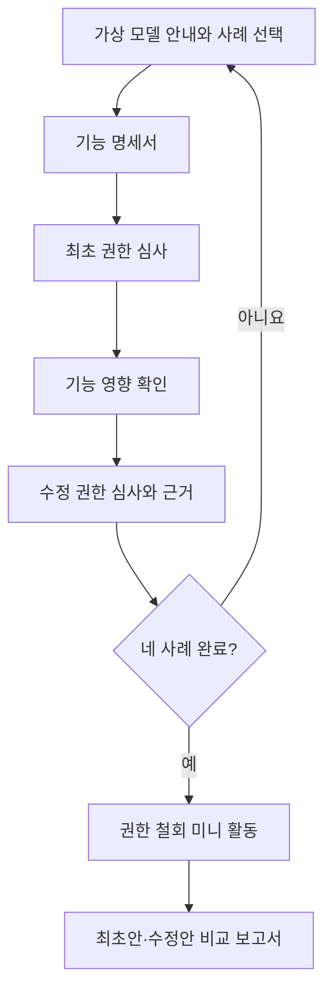

# Minimum Permission Lab Implementation Plan

> **For agentic workers:** REQUIRED SUB-SKILL: Use superpowers:subagent-driven-development (recommended) or superpowers:executing-plans to implement this plan task-by-task. Steps use checkbox (`- [ ]`) syntax for tracking.

**Goal:** 초등 5~6학년 학생이 네 가지 가상 앱 사례를 통해 기능 계약과 권한 요청을 비교하고, 최초 판단·수정 판단·철회 또는 대안 행동·근거 문장을 남기는 정적 학습 시뮬레이션을 구현한다.

**Architecture:** React 화면은 명시적인 학습 단계 상태 머신을 표시하고, 사례 콘텐츠·순수 판정 엔진·진행 상태·선택 저장 어댑터를 서로 분리한다. 실제 브라우저 권한이나 외부 네트워크를 전혀 사용하지 않으며, 모든 피드백은 고정된 기능 계약 데이터와 결정 규칙에서 생성한다. 네 사례를 모두 마친 뒤 철회 훈련과 최초안/수정안 비교 보고서로 이동한다.

**Tech Stack:** Vite, React, TypeScript, CSS, Vitest, Testing Library, Playwright, axe-core, ESLint, npm lockfile

---

## Spec

### Product contract

- 대상은 초등 5~6학년이며 한 차시 30~40분 안에 네 사례를 모두 경험하는 흐름으로 설계한다.
- 앱 전체에 `가상 학습 모델` 표지를 유지하고 실제 앱·운영체제·회사 화면을 모방하지 않는다.
- 실제 권한 요청, 기기 설정 변경, 실제 앱 검사·추천·차단, 계정, 교사 대시보드, 클라우드 저장, 분석 SDK, 광고, AI 판정은 구현하지 않는다.
- 학생의 최초 선택은 수정 선택과 별도 필드에 보존하며 보고서에서 나란히 비교한다.
- 권한을 무조건 거부하도록 유도하지 않는다. 기능 계약상 필요한 제한적 허용, 불필요한 접근의 거부, 설명 확인, 대안, 철회를 모두 유효한 학습 행동으로 다룬다.
- 기본 진행 기록은 React 메모리에만 둔다. 학생이 시작 화면의 `이 기기에 저장` 체크박스를 직접 켠 뒤에만 단일 localStorage 키에 보관하며, 새 탭에서는 `이 기기에 저장한 기록 불러오기` 버튼을 눌러야 저장값을 읽는다.

### Learning objectives and implementation evidence

| 학습 목표 | 구현 증거 | 검증 위치 |
|---|---|---|
| 권한이 기능과 기기 정보 사이의 접근 약속임을 설명 | 시작 안내와 권한 사전에서 기능·정보 연결 문장 제공 | `src/content/learningNotices.ts`, `src/content/permissions.ts`, Task 2·3 |
| 필요한 권한과 불필요한 권한 구분 | 네 사례의 기능 계약과 권한별 판정 규칙 | `src/content/cases/`, `src/domain/judgePermission.ts`, Task 3·4 |
| 사용 시점·보관 방식에 따라 판단이 달라짐을 비교 | 음성 재생 후 삭제 조건과 지도 현재 위치 표시 조건을 별도 비교 | `src/content/conditionalScenarios.ts`, `src/features/impact/`, Task 3·9 |
| 최소 허용안과 거부·대체·철회 이유 제시 | 최초안·수정안, 통제 행동, 근거 태그와 문장 틀, 최종 보고서 | `src/domain/buildReport.ts`, `src/features/report/`, Task 10·11 |
| 타인의 정보 존중 | 연락처 전체 접근 대신 저장되지 않는 가상 별명 직접 입력, 사진 속 타인 정보 안내 | `src/content/cases/groupBoard.ts`, `src/content/learningNotices.ts`, Task 3·7·11 |

### Differentiation boundary

시작 화면의 `이 활동이 하는 일`과 `이 활동이 하지 않는 일`을 분리한다. 이 앱은 수집 전 권한 필요성을 판단하는 학습 도구이며, 데이터 정제, 미디어 사용 시간 진단, 실제 보안 검사나 실제 앱 안전 판정 기능을 제공하지 않는다. 교사용 안내에는 플랫폼별 권한 명칭과 동작이 달라질 수 있고 실제 설정 방법은 기종별 공식 안내를 확인해야 한다는 문장을 넣되, MVP에서는 기종별 설정 절차를 제공하지 않는다.

| 비교 대상 | 구분되는 구현 경계 |
|---|---|
| AI 데이터 품질검사소 | 이미 수집된 자료의 오류를 고치는 기능 대신, 수집 전에 기능과 접근 권한의 필요성을 판단한다. |
| AI 디톡스 관련 활동 | 사용 시간과 습관을 진단하지 않고, 데이터 접근의 목적·시점·최소 범위를 설계한다. |
| 팩트체크 편집국 | 외부 주장의 사실성을 검증하지 않고, 가상 기능 계약에 비추어 기기 정보 요청의 타당성을 검토한다. |

### Case and judgment matrix

| 사례 ID | 핵심 기능 계약 | 핵심 판정 | 거부 영향 | 최소 정보 대안/통제 행동 |
|---|---|---|---|---|
| `photo-scan` | 학생이 촬영 버튼을 누를 때 종이 과제를 촬영 | 카메라 `required`; 마이크·위치·연락처 `unnecessary` | 카메라를 거부하면 촬영 기능만 제한 | 종이 과제를 직접 제출하거나 교사가 제공한 다른 제출 방법 확인 |
| `voice-reading` | 녹음 버튼을 누른 동안 음성을 녹음하고 바로 재생한 뒤 삭제 | 마이크 `conditional`; 카메라·위치·연락처 `unnecessary` | 마이크를 거부하면 녹음·재생 연습만 제한 | 교사 앞에서 직접 읽기; 녹음 종료 뒤 마이크 철회 |
| `class-map` | 앱에 미리 저장된 교실 지도를 표시 | 기본 위치 `unnecessary` | 위치를 거부해도 저장 지도 보기 가능 | 교실 이름 직접 선택; `내 위치 표시` 기능을 명시적으로 켠 경우에만 위치가 `conditional`로 바뀌는 비교 카드 제공 |
| `group-board` | 실제 이름이 아닌 가상 별명을 직접 입력해 기기 안의 알림 카드 작성을 시뮬레이션 | 연락처를 포함한 네 권한 모두 `unnecessary` | 모든 권한을 거부해도 핵심 기능 유지 | 연락처 전체 접근 대신 가상 별명 직접 입력; 예시 `햇살`, `새싹`, `푸른별`; 입력값은 화면 미리보기에만 쓰고 상태·저장·보고서에서 제외 |

설계 문서의 `입력한 별명`과 `직접 입력 대안`은 고정 선택지로 대체하지 않는다. 다만 개인정보 비수집 원칙을 함께 만족하도록 `가상 별명 연습` 입력은 컴포넌트가 화면에 있는 동안의 미리보기 값으로만 존재하고, 학습 진행 상태·선택 저장·보고서에는 절대 전달하지 않는다.

정확히 두 조건부 상황을 사용한다.

1. `voice-press-and-delete`: 녹음 버튼을 누른 동안만 마이크를 사용하고 재생 직후 삭제한다.
2. `map-current-position-opt-in`: 기본 저장 지도에는 위치가 필요 없지만 사용자가 별도 `내 위치 표시` 기능을 켠 경우에만 현재 사용 중 범위의 위치 접근을 검토한다.

### Learner flow and gates



- `기능 명세 보기`는 사례를 선택했고 명세를 아직 열지 않았을 때만 다음 핵심 버튼으로 강조한다.
- 최초 심사의 `선택 검토`는 네 권한에 모두 선택값이 있을 때 활성화하고, 수정 심사의 `선택 검토`는 네 수정 선택·근거 태그·근거 문장이 모두 있을 때 활성화한다. 활성화 조건을 충족한 현재 단계의 버튼 하나만 강조한다.
- `이번 기능에만 허용`, `허용하지 않음`, `설명을 더 확인` 세 선택에 모두 `학습용 선택지` 표지를 제공한다.
- 영향 확인을 거치기 전에는 수정안을 기록할 수 없다.
- 각 사례의 완료 조건은 최초안 4개, 영향 확인, 해당 조건 카드 확인, 수정안 4개, 근거 태그 1개 이상, 근거 문장 1개, 대안 또는 철회 행동 1개이다. 조건 카드가 없는 사례는 해당 조건 확인 항목을 자동 충족한다.
- 네 사례를 모두 완료하기 전에는 공통 철회 훈련과 최종 보고서로 이동할 수 없다.

### Feedback and evaluation model

- `required`: 제한적 허용은 기능 계약과 맞으며, 거부 선택에는 해당 기능만 제한된다는 설명을 제공한다.
- `unnecessary`: 거부는 최소 허용안과 맞으며, 허용 선택에는 더 적은 정보로 가능한 대안을 제시한다.
- `conditional`: 허용/거부를 단정 채점하지 않고 사용 시점·보관·별도 기능 켜기 조건을 다시 확인하게 한다.
- `more-info` 선택은 오답으로 처리하지 않고 해당 권한 카드의 자세한 설명과 계약 근거로 되돌린다.
- 자유 서술은 AI나 키워드로 채점하지 않는다. `function-connection`, `data-minimization`, `user-control`, `respect-others` 근거 태그의 선택 여부로 네 평가 요소의 증거를 표시하고, 문장 내용은 학생 보고서에만 그대로 반영한다.
- 피드백 문구에 `허용해서 틀림` 또는 공포를 유발하는 표현을 사용하지 않는다.

### Deterministic impact contract

`buildFunctionImpacts`는 다음 표를 그대로 사용한다. `coreFunction`, `denialImpact`, `alternative` 문자열은 현재 사례의 `PermissionRule`에서 가져오며 임의 문구를 만들지 않는다.

| 판정/선택 | `availableFunctions` | `limitedFunctions` | 다음 행동 |
|---|---|---|---|
| `required` + `allow-current-feature` | `[coreFunction]` | `[]` | 계속 |
| `required` + `deny` | `[alternative]` | `[denialImpact]` | 대안 또는 철회 확인 |
| `unnecessary` + `allow-current-feature` | `[coreFunction]` | `[]` | 최소 정보 대안 검토 |
| `unnecessary` + `deny` | `[coreFunction]` | `[]` | 계속 |
| `conditional` + `allow-current-feature` | 조건 확인 뒤 `[coreFunction]` | 조건 확인 전 `[denialImpact]`, 확인 뒤 `[]` | 조건 카드 확인 |
| `conditional` + `deny` | `[alternative]` | `[denialImpact]` | 대안 확인 |
| 모든 판정 + `more-info` | `[]` | `[]` | 자세한 계약 근거 열기 |

`map-current-position-opt-in`의 조건 카드는 위치 거부 시 저장된 지도 보기를 `availableFunctions`에 유지하고 현재 위치 표시만 `limitedFunctions`에 둔다. `voice-press-and-delete`의 조건 카드는 마이크 거부 시 직접 읽기 대안을 유지하고 녹음·바로 재생만 제한한다.

### Completion criteria

- 모든 경로에서 실제 브라우저 권한 팝업과 외부 네트워크 요청이 0건이다.
- 모든 권한 선택에서 해당 기능 계약 문장으로 이동하는 근거 링크가 있다.
- 조건부 권한은 조건과 대안을 함께 보여 주며 무조건 허용·거부로 판정하지 않는다.
- 모든 사례에서 학생이 대안 또는 철회 행동을 한 번 이상 수행한다.
- 375×812 뷰포트, 키보드 전용, 모션 감소 설정에서 전체 과정을 완료한다.
- 스크린 리더가 단계 제목, 선택 상태, 영향 변화, 오류, 대화상자 열림/닫힘을 읽는다.
- 보고서 상단과 인쇄 결과에 `가상 학습 모델이며 실제 앱 판정이 아님`을 명확히 표시한다.

## Global Constraints

1. `navigator.permissions`, `navigator.geolocation`, `navigator.contacts`, `mediaDevices.getUserMedia`, 카메라·마이크·위치·연락처 API를 호출하지 않는다.
2. `fetch`, XMLHttpRequest, WebSocket, 외부 폰트, CDN, 분석·광고·AI SDK를 사용하지 않는다. 모든 아이콘과 콘텐츠는 저장소 내부 자산 또는 CSS로 제공한다.
3. 실제 이름·사진·음성·위치·연락처를 입력하거나 업로드하는 컨트롤을 만들지 않는다. 설계가 요구하는 모둠 알림판의 `가상 별명 연습` 텍스트 상자만 예외로 두되 실제 이름 금지 안내, `autocomplete="off"`, 최대 12자, 컴포넌트 로컬 상태, 화면 이탈 시 삭제를 적용하고 `LabState`, localStorage, 보고서에 포함하지 않는다. 근거 문장 입력란에도 실제 이름이나 개인 정보를 쓰지 말라는 안내를 연결한다.
4. 단일 소스 및 테스트 파일은 500줄 미만으로 유지한다. 350줄에 가까워지면 콘텐츠, 상태 전이, 화면 하위 컴포넌트를 책임별 파일로 먼저 분리한다.
5. 판정 엔진과 보고서 생성기는 React와 브라우저 API에 의존하지 않는 순수 함수로 유지한다.
6. 기본 상태에서는 localStorage를 읽거나 쓰지 않는다. 시작 화면의 명시적 불러오기 행동 뒤에만 한 번 읽으며, 저장 동의 해제와 기록 삭제는 `minimum-permission-lab:v1` 키만 제거한다.
7. 핵심 버튼의 `gi-pulse`는 동시에 하나만 적용한다. `prefers-reduced-motion: reduce`에서는 애니메이션을 제거하고 3px 고정 테두리와 보이는 단계 번호를 사용한다.
8. 색만으로 권한을 구분하지 않는다. 모든 권한은 아이콘, 텍스트, 고유 모양 라벨을 함께 사용한다.
9. 수정할 때마다 `src/content/updateHistory.ts`에 ISO 날짜, 구분, 학생이 이해할 수 있는 변경 내역, 변경 이유를 추가한다.
10. 각 작업은 실패 테스트 작성 → 예상 실패 확인 → 최소 구현 → 통과 확인 → 관련 회귀 테스트 → 작은 커밋 순서를 지킨다.
11. 아래 명령은 구현 단계에서 실행할 항목이다. 이 계획 작성 단계에서는 설치, 테스트, Git 초기화, 커밋, 푸시, 배포를 실행하지 않는다.
12. 배포와 외부 아카이브 등록은 이 MVP 구현 계획의 완료 조건이 아니다. 로컬 검증 완료 뒤 별도 사용자 지시가 있을 때만 진행한다.

## Expected File Structure and Responsibilities

```text
minimum-permission-lab/
├── 2026-08-26-minimum-permission-lab-design.md
├── 2026-08-26-minimum-permission-lab-implementation-plan.md
├── index.html
├── package.json
├── package-lock.json
├── tsconfig.json
├── tsconfig.app.json
├── tsconfig.node.json
├── vite.config.ts
├── vitest.config.ts
├── playwright.config.ts
├── eslint.config.js
├── scripts/
│   ├── check-source-policy.mjs
│   └── check-source-policy.test.mjs
├── public/
│   └── favicon.svg
├── docs/qa/
│   ├── accessibility-checklist.md
│   └── privacy-safety-checklist.md
├── src/
│   ├── main.tsx
│   ├── app/
│   │   ├── App.tsx
│   │   ├── App.test.tsx
│   │   ├── LabProvider.tsx
│   │   ├── LabProvider.test.tsx
│   │   ├── labReducer.ts
│   │   ├── labReducer.test.ts
│   │   └── labSelectors.ts
│   ├── domain/
│   │   ├── model.ts
│   │   ├── judgePermission.ts
│   │   ├── judgePermission.test.ts
│   │   ├── buildFunctionImpacts.ts
│   │   ├── buildFunctionImpacts.test.ts
│   │   ├── buildReport.ts
│   │   └── buildReport.test.ts
│   ├── content/
│   │   ├── permissions.ts
│   │   ├── permissions.test.ts
│   │   ├── conditionalScenarios.ts
│   │   ├── learningNotices.ts
│   │   ├── learningNotices.test.ts
│   │   ├── updateHistory.ts
│   │   ├── updateHistory.test.ts
│   │   └── cases/
│   │       ├── photoScan.ts
│   │       ├── voiceReading.ts
│   │       ├── classMap.ts
│   │       ├── groupBoard.ts
│   │       ├── index.ts
│   │       └── cases.test.ts
│   ├── storage/
│   │   ├── progressStorage.ts
│   │   └── progressStorage.test.ts
│   ├── components/
│   │   ├── AppHeader.tsx
│   │   ├── ProgressIndicator.tsx
│   │   ├── LearningModelNotice.tsx
│   │   ├── PrimaryActionButton.tsx
│   │   ├── PermissionGlyph.tsx
│   │   ├── StatusLiveRegion.tsx
│   │   ├── UpdateHistoryButton.tsx
│   │   ├── UpdateHistoryDialog.tsx
│   │   └── UpdateHistoryDialog.test.tsx
│   ├── features/
│   │   ├── start/
│   │   │   ├── StartScreen.tsx
│   │   │   ├── CaseSelector.tsx
│   │   │   └── StartScreen.test.tsx
│   │   ├── specification/
│   │   │   ├── FeatureSpecScreen.tsx
│   │   │   ├── DataFlowSummary.tsx
│   │   │   ├── FictionalAliasPractice.tsx
│   │   │   └── FeatureSpecScreen.test.tsx
│   │   ├── review/
│   │   │   ├── PermissionReviewScreen.tsx
│   │   │   ├── PermissionCard.tsx
│   │   │   ├── PermissionChoiceGroup.tsx
│   │   │   ├── RationaleComposer.tsx
│   │   │   ├── ContractEvidencePanel.tsx
│   │   │   └── PermissionReviewScreen.test.tsx
│   │   ├── impact/
│   │   │   ├── ImpactScreen.tsx
│   │   │   ├── FunctionImpactList.tsx
│   │   │   ├── ConditionalScenarioCard.tsx
│   │   │   └── ImpactScreen.test.tsx
│   │   ├── revoke/
│   │   │   ├── RevokeTrainingScreen.tsx
│   │   │   ├── PermissionUseLog.tsx
│   │   │   └── RevokeTrainingScreen.test.tsx
│   │   └── report/
│   │       ├── ReportScreen.tsx
│   │       ├── DecisionComparisonTable.tsx
│   │       ├── EvidenceRubric.tsx
│   │       ├── CompletionSummary.tsx
│   │       ├── CompletionSummary.test.tsx
│   │       └── ReportScreen.test.tsx
│   ├── styles/
│   │   ├── tokens.css
│   │   ├── global.css
│   │   ├── components.css
│   │   ├── styles.test.ts
│   │   └── print.css
│   └── test/
│       ├── setup.ts
│       ├── renderLab.tsx
│       └── fixtures.ts
└── e2e/
    ├── helpers/
    │   └── keyboardFlow.ts
    ├── full-learning-flow.spec.ts
    ├── accessibility.spec.ts
    ├── mobile-reduced-motion.spec.ts
    └── privacy-safety.spec.ts
```

각 `.ts`, `.tsx`, `.css` 파일은 하나의 책임만 가지며 500줄 미만이다. 사례 데이터는 사례별 파일, 공통 권한 설명은 `permissions.ts`, 조건 비교는 `conditionalScenarios.ts`로 나눠 콘텐츠 변경이 판정 로직을 비대하게 만들지 않도록 한다.

## Shared Types and Interfaces

`src/domain/model.ts`는 아래 이름과 의미를 고정한다.

```ts
export type CaseId = 'photo-scan' | 'voice-reading' | 'class-map' | 'group-board';
export type PermissionId = 'camera' | 'microphone' | 'location' | 'contacts';
export type LearnerChoice = 'allow-current-feature' | 'deny' | 'more-info';
export type ContractVerdict = 'required' | 'unnecessary' | 'conditional';
export type ConditionalScenarioId =
  | 'voice-press-and-delete'
  | 'map-current-position-opt-in';
export type FeatureSwitchId = 'map-current-position';
export type ReasonTagId =
  | 'function-connection'
  | 'data-minimization'
  | 'user-control'
  | 'respect-others';
export type LabStage =
  | 'start'
  | 'specification'
  | 'initial-review'
  | 'impact'
  | 'revision-review'
  | 'revocation'
  | 'report';

export interface PermissionDefinition {
  id: PermissionId;
  label: string;
  shortDescription: string;
  detailDescription: string;
  shapeLabel: string;
  iconName: 'camera-frame' | 'sound-wave' | 'map-pin' | 'people-card';
}

export interface PermissionRule {
  permissionId: PermissionId;
  verdict: ContractVerdict;
  neededInformation: string;
  timing: string;
  denialImpact: string;
  alternative: string;
  contractEvidence: string;
  conditionId?: ConditionalScenarioId;
}

export interface AppCase {
  id: CaseId;
  title: string;
  coreFunction: string;
  dataFlow: readonly string[];
  retentionPromise: string;
  requestedPermissions: readonly PermissionId[];
  rules: Readonly<Record<PermissionId, PermissionRule>>;
}

export interface PermissionDecision {
  permissionId: PermissionId;
  choice: LearnerChoice;
}

export interface CaseProgress {
  initialDecisions: Partial<Record<PermissionId, PermissionDecision>>;
  revisedDecisions: Partial<Record<PermissionId, PermissionDecision>>;
  reasonTags: readonly ReasonTagId[];
  rationaleText: string;
  enabledFeatureSwitchIds: readonly FeatureSwitchId[];
  acknowledgedConditionIds: readonly ConditionalScenarioId[];
  impactViewed: boolean;
  controlAction: 'alternative' | 'revoke' | null;
  completed: boolean;
}

export interface LabState {
  stage: LabStage;
  activeCaseId: CaseId | null;
  caseProgress: Record<CaseId, CaseProgress>;
  revocationCompleted: boolean;
  revocationDecisions: Partial<Record<PermissionId, RevocationDecision>>;
  saveOnDevice: boolean;
  statusMessage: string;
}

export interface JudgmentResult {
  permissionId: PermissionId;
  verdict: ContractVerdict;
  alignment: 'supported' | 'review-contract' | 'needs-information';
  feedback: string;
  contractEvidence: string;
  denialImpact: string;
  alternative: string;
  nextAction: 'continue' | 'open-details' | 'compare-condition';
}

export interface RevocationDecision {
  permissionId: PermissionId;
  action: 'keep-current-feature' | 'revoke-now';
}

export interface ReportCaseResult {
  caseId: CaseId;
  initial: readonly PermissionDecision[];
  revised: readonly PermissionDecision[];
  changedPermissionIds: readonly PermissionId[];
  reasonTags: readonly ReasonTagId[];
  rationaleText: string;
  rubricEvidence: Readonly<Record<ReasonTagId, 'sufficient' | 'needs-support'>>;
  controlAction: 'alternative' | 'revoke';
}

export interface LabReport {
  cases: readonly ReportCaseResult[];
  revokedPermissionIds: readonly PermissionId[];
}
```

`src/storage/progressStorage.ts`는 브라우저 저장소를 직접 전역 참조하지 않고 다음 포트를 받는다.

```ts
export interface KeyValueStorage {
  getItem(key: string): string | null;
  setItem(key: string, value: string): void;
  removeItem(key: string): void;
}

export const PROGRESS_STORAGE_KEY = 'minimum-permission-lab:v1';
export function loadSavedProgress(storage: KeyValueStorage): LabState | null;
export function saveProgress(storage: KeyValueStorage, state: LabState): void;
export function clearSavedProgress(storage: KeyValueStorage): void;
```

저장된 기록은 시작 시 자동으로 읽지 않는다. 시작 화면의 `이 기기에 저장` 체크박스는 `SET_SAVE_ON_DEVICE`를 dispatch하고, 체크된 뒤의 진행 변경만 `saveProgress`를 호출한다. 새 탭에서 학생이 `이 기기에 저장한 기록 불러오기`를 누르면 `loadSavedProgress`를 한 번 호출하고, 유효한 기록이 있을 때만 `LOAD_SAVED_PROGRESS`로 상태를 교체한다.

## Requirement Traceability

| 설계 요구 | 구현 작업 | 자동/수동 합격 조건 |
|---|---|---|
| 4개 가상 앱·4개 권한·조건부 2종 | Task 2·3 | 콘텐츠 테스트가 ID 집합과 조건 ID 2개를 정확히 검증 |
| 최초안과 수정안 비교 | Task 5·9·11 | 수정 후에도 최초 객체가 바뀌지 않고 보고서 두 열에 모두 표시 |
| 기능 계약 근거 | Task 3·4·8 | 모든 결과에 `contractEvidence`가 비어 있지 않고 링크 버튼으로 노출 |
| 대안 또는 철회 경험 | Task 9·10 | 각 사례 `controlAction` 필수, 공통 철회 훈련 완료 뒤 보고서 이동 |
| 조건부 피드백의 비단정성 | Task 4·9 | 허용·거부 어느 선택에도 오답 단정 문구가 없고 조건 확인 행동 제공 |
| 접근성·모바일·모션 감소 | Task 8·13·15 | axe 위반 0, 375×812 완료, 키보드 완료, 모션 0초 대체 강조 확인 |
| 개인정보·안전 | Task 6·14 | 명시적 불러오기 전 localStorage 읽기·쓰기 0, 외부 요청 0, 금지 API 호출 0 |
| 가상 모델 고지 | Task 3·7·11 | 시작·헤더·보고서·인쇄물에서 고지 확인 |
| 업데이트 내역 | Task 12 | 우하단 버튼, 초점 관리 대화상자, 2026-08-26 설계 기록과 실제 구현일 개발 기록 표시 |
| 실제 앱·OS 일반화 방지 | Task 3·14 | 교사용 안내와 결과 면책 문구가 모두 렌더링 |

## Implementation Tasks

### Task 1: Repository, Tooling, and Smoke-Test Bootstrap

**Files:**
- Create: `package.json`
- Create: `package-lock.json` through npm
- Create: `index.html`
- Create: `tsconfig.json`
- Create: `tsconfig.app.json`
- Create: `tsconfig.node.json`
- Create: `vite.config.ts`
- Create: `vitest.config.ts`
- Create: `playwright.config.ts`
- Create: `eslint.config.js`
- Create: `public/favicon.svg`
- Create: `src/main.tsx`
- Create: `src/app/App.tsx`
- Create: `src/app/App.test.tsx`
- Create: `src/test/setup.ts`

**Interfaces:** `App(): ReactElement`; npm scripts `dev`, `build`, `preview`, `lint`, `test`, `test:run`, `test:coverage`, `test:e2e`, `check:policy`.

- [ ] **Step 1: Initialize the future repository and branch.** Run `git init` then `git branch -M main`. Expected: an empty repository on branch `main`; no remote is configured.
- [ ] **Step 2: Create the package and tool configuration files.** Configure Vite with relative asset base `./`, Vitest with jsdom and `src/test/setup.ts`, coverage thresholds of 85% statements/lines/functions and 80% branches, Playwright `baseURL` `http://127.0.0.1:4173`, a `webServer` command `npm run dev -- --host 127.0.0.1 --port 4173`, desktop Chromium and `mobile-375` projects, and ESLint for TypeScript/React.
- [ ] **Step 3: Install the declared runtime and development dependencies.** Run `npm install react react-dom` and `npm install -D typescript vite @vitejs/plugin-react @types/react @types/react-dom vitest @vitest/coverage-v8 jsdom @testing-library/react @testing-library/jest-dom @testing-library/user-event eslint @eslint/js typescript-eslint eslint-plugin-react-hooks eslint-plugin-react-refresh globals @playwright/test @axe-core/playwright`. Expected: exit code 0 and a new `package-lock.json`.
- [ ] **Step 4: Install the future E2E browser.** Run `npx playwright install chromium`. Expected: Chromium is available to Playwright without changing app source.
- [ ] **Step 5: Write the failing smoke test.** `src/app/App.test.tsx` renders `App` and requires a level-1 heading named `앱 권한 최소허용 연구소` plus the visible phrase `가상 학습 모델`.
- [ ] **Step 6: Run the smoke test and verify failure.** Run `npm run test:run -- src/app/App.test.tsx`. Expected: FAIL because `App` and its required heading/notice are not implemented.
- [ ] **Step 7: Add the minimum app entry implementation.** `App.tsx` renders only the required title and notice; `main.tsx` mounts it into `#root`; `index.html` contains no external assets or scripts.
- [ ] **Step 8: Re-run checks.** Run `npm run test:run -- src/app/App.test.tsx`, `npm run lint`, and `npm run build`. Expected: one smoke test passes, lint exits 0, and `dist/index.html` is produced.
- [ ] **Step 9: Commit the bootstrap.** Run `git add 2026-08-26-minimum-permission-lab-design.md 2026-08-26-minimum-permission-lab-implementation-plan.md package.json package-lock.json index.html tsconfig.json tsconfig.app.json tsconfig.node.json vite.config.ts vitest.config.ts playwright.config.ts eslint.config.js public/favicon.svg src/main.tsx src/app/App.tsx src/app/App.test.tsx src/test/setup.ts` then `git commit -m "chore: bootstrap minimum permission lab"`. Expected: one root commit containing documentation, toolchain, and the passing smoke test.

### Task 2: Domain Types and Four-Permission Catalog

**Files:**
- Create: `src/domain/model.ts`
- Create: `src/content/permissions.ts`
- Create: `src/content/permissions.test.ts`
- Create: `src/components/PermissionGlyph.tsx`

**Interfaces:** `CaseId`, `PermissionId`, `LearnerChoice`, `ContractVerdict`, `PermissionDefinition`, `PermissionRule`, `AppCase`, `PermissionDecision`, `CaseProgress`, `LabState`, `JudgmentResult`, `ReportCaseResult`; `getPermissionDefinition(id: PermissionId): PermissionDefinition`.

- [ ] **Step 1: Write the failing catalog tests.** Assert that the catalog contains exactly `camera`, `microphone`, `location`, `contacts`; each item has non-empty short/detail descriptions, a unique `shapeLabel`, a named local glyph, and no color value as identity.
- [ ] **Step 2: Verify the expected failure.** Run `npm run test:run -- src/content/permissions.test.ts`. Expected: FAIL because `model.ts` and the catalog export do not exist.
- [ ] **Step 3: Implement the minimum shared types and catalog.** Use elementary Korean descriptions and the glyph names fixed in Shared Types. `PermissionGlyph` renders an internal SVG with `aria-hidden="true"`; the adjacent visible label carries the accessible name.
- [ ] **Step 4: Verify type and test success.** Run `npm run test:run -- src/content/permissions.test.ts` and `npm run build`. Expected: four catalog assertions pass and TypeScript reports no missing union members.
- [ ] **Step 5: Commit the catalog.** Run `git add src/domain/model.ts src/content/permissions.ts src/content/permissions.test.ts src/components/PermissionGlyph.tsx` then `git commit -m "feat: define permission learning model"`. Expected: one focused domain/content commit.

### Task 3: Four Case Packs, Two Conditional Situations, and Safety Copy

**Files:**
- Create: `src/content/cases/photoScan.ts`
- Create: `src/content/cases/voiceReading.ts`
- Create: `src/content/cases/classMap.ts`
- Create: `src/content/cases/groupBoard.ts`
- Create: `src/content/cases/index.ts`
- Create: `src/content/cases/cases.test.ts`
- Create: `src/content/conditionalScenarios.ts`
- Create: `src/content/learningNotices.ts`
- Create: `src/content/learningNotices.test.ts`

**Interfaces:** `APP_CASES: Readonly<Record<CaseId, AppCase>>`; `CASE_ORDER: readonly CaseId[]`; `GROUP_BOARD_ALIAS_EXAMPLES: readonly ['햇살', '새싹', '푸른별']`; `ConditionalScenario { id: ConditionalScenarioId; caseId: CaseId; permissionId: PermissionId; featureSwitchId?: FeatureSwitchId; changedContract: string; requiredConditions: readonly string[]; comparisonPrompt: string }`; `LEARNING_MODEL_NOTICE`, `TEACHER_GUIDE_NOTICE`, `HELP_REQUEST_NOTICE`, `NOT_IN_SCOPE_NOTICE`.

- [ ] **Step 1: Write failing content-contract tests.** Verify the exact four case IDs, four permission rules per case, one alternative per rule, non-empty denial impact and contract evidence, exactly two conditional scenario IDs, base `class-map` location verdict `unnecessary`, and the exact three fictional alias examples. Assert no alias field exists in `AppCase`, `CaseProgress`, or saved-progress schemas.
- [ ] **Step 2: Add failing safety-copy tests.** Require the phrases `실제 앱 판정이 아님`, `기기와 운영체제에 따라 다를 수 있음`, `교사나 보호자에게 도움을 요청`, and exclusions for data cleaning, use-time diagnosis, and security inspection.
- [ ] **Step 3: Run both tests to observe failure.** Run `npm run test:run -- src/content/cases/cases.test.ts src/content/learningNotices.test.ts`. Expected: FAIL because case packs, conditional scenarios, and notices are absent.
- [ ] **Step 4: Implement the four focused case modules.** Encode the Case and Judgment Matrix exactly, keep fictional names only, use no real brand or victim story, and include the four card questions through each rule's information, timing, denial, and alternative fields.
- [ ] **Step 5: Implement the two condition comparisons and learning notices.** The map condition must not alter the base stored-map verdict; it is a clearly labeled hypothetical contract change. The voice condition must mention active recording and immediate deletion.
- [ ] **Step 6: Run content checks.** Run `npm run test:run -- src/content/cases/cases.test.ts src/content/learningNotices.test.ts` and `npm run build`. Expected: all four cases and two conditions pass schema assertions; no TypeScript error.
- [ ] **Step 7: Commit case content.** Run `git add src/content/cases/photoScan.ts src/content/cases/voiceReading.ts src/content/cases/classMap.ts src/content/cases/groupBoard.ts src/content/cases/index.ts src/content/cases/cases.test.ts src/content/conditionalScenarios.ts src/content/learningNotices.ts src/content/learningNotices.test.ts` then `git commit -m "feat: add four virtual permission cases"`. Expected: one content-only commit.

### Task 4: Pure Permission Judgment Engine

**Files:**
- Create: `src/domain/judgePermission.ts`
- Create: `src/domain/judgePermission.test.ts`

**Interfaces:** `judgePermission(rule: PermissionRule, choice: LearnerChoice): JudgmentResult`; `ConditionalJudgmentContext { conditionAcknowledged: boolean; featureSwitchEnabled: boolean }`; `judgeConditionalScenario(rule: PermissionRule, choice: LearnerChoice, context: ConditionalJudgmentContext): JudgmentResult`.

- [ ] **Step 1: Write the failing decision-table tests.** Cover every combination of three verdicts and three learner choices. Assert `more-info` always returns `needs-information/open-details`; required+allow returns `supported`; unnecessary+deny returns `supported`; conditional choices return `compare-condition` without an incorrect-answer judgment.
- [ ] **Step 2: Add failing conditional-context tests.** For `map-current-position-opt-in`, switch off returns the base `unnecessary` judgment, switch on plus unacknowledged returns `conditional/compare-condition`, and switch on plus acknowledged allows continuation. For `voice-press-and-delete`, unacknowledged returns `compare-condition` and acknowledged preserves the neutral conditional verdict while allowing continuation.
- [ ] **Step 3: Add language guard tests.** Scan all returned feedback and assert it excludes `허용해서 틀림`, `무조건 위험`, `안전한 앱으로 판정`, and claims of real measurement.
- [ ] **Step 4: Run the engine tests and verify failure.** Run `npm run test:run -- src/domain/judgePermission.test.ts`. Expected: FAIL because both pure functions are missing.
- [ ] **Step 5: Implement the smallest table-driven engine.** Build results only from rule data, conditional context, and fixed neutral templates; do not inspect rationale free text, invoke browser APIs, or import React.
- [ ] **Step 6: Run engine and coverage checks.** Run `npm run test:run -- src/domain/judgePermission.test.ts` and `npm run test:coverage -- src/domain/judgePermission.test.ts`. Expected: all nine base decision combinations and five conditional-context cases pass, and this module has 100% branch coverage.
- [ ] **Step 7: Commit the engine.** Run `git add src/domain/judgePermission.ts src/domain/judgePermission.test.ts` then `git commit -m "feat: add contract based permission judgment"`. Expected: one pure-domain commit.

### Task 5: Learning State Machine and Immutable First/Revision Records

**Files:**
- Create: `src/app/labReducer.ts`
- Create: `src/app/labReducer.test.ts`
- Create: `src/app/labSelectors.ts`
- Create: `src/app/LabProvider.tsx`
- Create: `src/test/fixtures.ts`

**Interfaces:** `LabAction` union with `SELECT_CASE`, `OPEN_SPECIFICATION`, `SET_INITIAL_DECISION`, `OPEN_IMPACT`, `SET_FEATURE_SWITCH`, `ACKNOWLEDGE_CONDITION`, `SET_REVISED_DECISION`, `SET_CASE_RATIONALE_TEXT`, `TOGGLE_CASE_REASON_TAG`, `SET_CONTROL_ACTION`, `COMPLETE_CASE`, `OPEN_REVOCATION`, `SET_REVOCATION_DECISION`, `COMPLETE_REVOCATION`, `OPEN_REPORT`, `SET_SAVE_ON_DEVICE`, `LOAD_SAVED_PROGRESS`, `RESET_LAB`; `SET_FEATURE_SWITCH { caseId: CaseId; switchId: FeatureSwitchId; enabled: boolean }`; `ACKNOWLEDGE_CONDITION { caseId: CaseId; conditionId: ConditionalScenarioId }`; `SET_CASE_RATIONALE_TEXT { caseId: CaseId; value: string }`; `TOGGLE_CASE_REASON_TAG { caseId: CaseId; tagId: ReasonTagId }`; `SET_REVOCATION_DECISION { decision: RevocationDecision }`; `SET_SAVE_ON_DEVICE { enabled: boolean }`; `LOAD_SAVED_PROGRESS { state: LabState }`; selectors `isCurrentCaseReadyForImpact`, `isCurrentCaseReadyToComplete`, `areAllCasesComplete`, `isRevocationReadyToComplete`, `getNextIncompleteCaseId`.

- [ ] **Step 1: Write failing reducer transition tests.** Require start→specification→initial-review→impact→revision-review, block skipped stages, and reject report navigation until four cases and revocation are complete.
- [ ] **Step 2: Write the immutable evidence test.** Set four initial decisions, revise one permission, set the active case's rationale text and toggle one reason tag, then assert the initial decision object remains unchanged while revised decisions and case-level rationale evidence update in their separate fields.
- [ ] **Step 3: Write completion selector tests.** A case is incomplete until it has four initial decisions, impact viewed, every conditional scenario assigned to that case in `conditionalScenarios.ts` appears in `acknowledgedConditionIds`, four revised decisions, at least one reason tag, one non-empty rationale sentence, and a control action. The map condition is acknowledged only after `map-current-position` has been toggled on at least once. All cases must pass before `OPEN_REVOCATION`; all four revocation decisions with at least one `revoke-now` are required before `COMPLETE_REVOCATION`.
- [ ] **Step 4: Run tests and verify failure.** Run `npm run test:run -- src/app/labReducer.test.ts`. Expected: FAIL because the reducer, selectors, provider, and fixtures do not exist.
- [ ] **Step 5: Implement the minimum reducer and selectors.** Keep transition validation in pure functions under 300 lines; keep React context wiring in `LabProvider.tsx` under 180 lines.
- [ ] **Step 6: Re-run targeted tests.** Run `npm run test:run -- src/app/labReducer.test.ts` and `npm run build`. Expected: all transition, guard, and immutability tests pass.
- [ ] **Step 7: Commit state management.** Run `git add src/app/labReducer.ts src/app/labReducer.test.ts src/app/labSelectors.ts src/app/LabProvider.tsx src/test/fixtures.ts` then `git commit -m "feat: add guarded learning flow state"`. Expected: one state-machine commit.

### Task 6: Explicit Opt-In Local Progress Storage

**Files:**
- Create: `src/storage/progressStorage.ts`
- Create: `src/storage/progressStorage.test.ts`
- Create: `src/app/LabProvider.test.tsx`
- Modify: `src/app/LabProvider.tsx`
- Modify: `src/app/labReducer.ts`
- Modify: `src/app/labReducer.test.ts`

**Interfaces:** `KeyValueStorage`; `PROGRESS_STORAGE_KEY`; `SavedProgressV1 { version: 1, state: LabState }`; `loadSavedProgress`, `saveProgress`, `clearSavedProgress`; `LabContextValue { state: LabState; dispatch: Dispatch<LabAction>; setSaveOnDevice: (enabled: boolean) => void; loadSavedProgressOnRequest: () => void }`.

- [ ] **Step 1: Write failing adapter tests.** Test valid version-1 round trip, malformed JSON returning null without throwing, unknown version returning null, and deletion of only `minimum-permission-lab:v1`.
- [ ] **Step 2: Write failing provider privacy tests.** Render the provider with a storage spy and assert zero `getItem`/`setItem` calls before an explicit save or load action; invoke `setSaveOnDevice(true)` and assert one write; invoke `loadSavedProgressOnRequest()` and assert one read; invoke `setSaveOnDevice(false)` and assert one remove with no unrelated key removal.
- [ ] **Step 3: Run tests to verify failure.** Run `npm run test:run -- src/storage/progressStorage.test.ts src/app/LabProvider.test.tsx src/app/labReducer.test.ts`. Expected: FAIL because storage functions, explicit load, and consent wiring are absent.
- [ ] **Step 4: Implement the minimum adapter and consent wiring.** Persist only lab stage, structured selections, enabled feature switches, acknowledged condition IDs, case-level reason tags and rationale text, case control actions, common revocation decisions, and save flag. Expose an explicit load callback from `LabProvider`; do not read on mount or add timestamps, device identifiers, names, analytics IDs, or network sync.
- [ ] **Step 5: Re-run privacy tests.** Run `npm run test:run -- src/storage/progressStorage.test.ts src/app/LabProvider.test.tsx src/app/labReducer.test.ts`. Expected: all malformed-data, explicit-load, and opt-in-only tests pass.
- [ ] **Step 6: Commit storage.** Run `git add src/storage/progressStorage.ts src/storage/progressStorage.test.ts src/app/LabProvider.tsx src/app/LabProvider.test.tsx src/app/labReducer.ts src/app/labReducer.test.ts` then `git commit -m "feat: add opt in local progress saving"`. Expected: one privacy-scoped commit.

### Task 7: App Shell, Start Screen, Case Selection, and Feature Specification

**Files:**
- Modify: `src/app/App.tsx`
- Modify: `src/app/App.test.tsx`
- Create: `src/components/AppHeader.tsx`
- Create: `src/components/ProgressIndicator.tsx`
- Create: `src/components/LearningModelNotice.tsx`
- Create: `src/components/PrimaryActionButton.tsx`
- Create: `src/features/start/StartScreen.tsx`
- Create: `src/features/start/CaseSelector.tsx`
- Create: `src/features/start/StartScreen.test.tsx`
- Create: `src/features/specification/FeatureSpecScreen.tsx`
- Create: `src/features/specification/DataFlowSummary.tsx`
- Create: `src/features/specification/FictionalAliasPractice.tsx`
- Create: `src/features/specification/FeatureSpecScreen.test.tsx`
- Create: `src/test/renderLab.tsx`

**Interfaces:** `PrimaryActionButtonProps { pulse: boolean; stepNumber: number; disabled?: boolean }`; `CaseSelectorProps { completedCaseIds: readonly CaseId[]; selectedCaseId: CaseId | null; onSelect: (caseId: CaseId) => void }`; `StartScreenProps { state: LabState; onSelectCase: (caseId: CaseId) => void; onOpenSpecification: () => void; onSaveOnDeviceChange: (enabled: boolean) => void; onLoadSavedProgress: () => void }`; `FeatureSpecScreenProps { appCase: AppCase; onBeginReview: () => void }`; `FictionalAliasPracticeProps { examples: readonly string[] }` with internal `useState<string>` only.

- [ ] **Step 1: Write failing start-screen tests.** Require the Korean title, learning goal, virtual-model notice, differentiation boundary, teacher guide details, four case buttons, completed-state labels, an unchecked `이 기기에 저장` checkbox wired to `onSaveOnDeviceChange`, explicit `이 기기에 저장한 기록 불러오기`, shared-device warning, and disabled `기능 명세 보기` until a case is selected.
- [ ] **Step 2: Write failing feature-spec tests.** Require core function, ordered data flow, retention promise, requested permissions, four guiding questions, and a button that moves to initial review. For `group-board`, require one textbox named `가상 별명 연습`, three example strings, `autocomplete="off"`, 12-character limit, real-name warning, local preview, and proof that unmount/remount clears the value.
- [ ] **Step 3: Verify both test files fail.** Run `npm run test:run -- src/features/start/StartScreen.test.tsx src/features/specification/FeatureSpecScreen.test.tsx src/app/App.test.tsx`. Expected: FAIL because stage-driven screens are not mounted.
- [ ] **Step 4: Implement the minimum shell and screen routing.** `App.tsx` chooses one screen from `LabState.stage`; the header always displays the current step and virtual-model notice; no URL router is needed.
- [ ] **Step 5: Implement start/specification components.** Use native checkbox/buttons, headings in order, `<details>` for teacher guidance, and `<ol>` for data flow. Keep `FictionalAliasPractice` state inside that component, never dispatch it, and do not show real brand or device-setting instructions.
- [ ] **Step 6: Re-run component tests.** Run `npm run test:run -- src/features/start/StartScreen.test.tsx src/features/specification/FeatureSpecScreen.test.tsx src/app/App.test.tsx`. Expected: all start, specification, and app smoke assertions pass.
- [ ] **Step 7: Commit the first learner screens.** Run `git add src/app/App.tsx src/app/App.test.tsx src/components/AppHeader.tsx src/components/ProgressIndicator.tsx src/components/LearningModelNotice.tsx src/components/PrimaryActionButton.tsx src/features/start/StartScreen.tsx src/features/start/CaseSelector.tsx src/features/start/StartScreen.test.tsx src/features/specification/FeatureSpecScreen.tsx src/features/specification/DataFlowSummary.tsx src/features/specification/FictionalAliasPractice.tsx src/features/specification/FeatureSpecScreen.test.tsx src/test/renderLab.tsx` then `git commit -m "feat: add case selection and function specification"`. Expected: one learner-flow commit.

### Task 8: Accessible Permission Review and Contract Evidence

**Files:**
- Create: `src/components/StatusLiveRegion.tsx`
- Create: `src/features/review/PermissionReviewScreen.tsx`
- Create: `src/features/review/PermissionCard.tsx`
- Create: `src/features/review/PermissionChoiceGroup.tsx`
- Create: `src/features/review/RationaleComposer.tsx`
- Create: `src/features/review/ContractEvidencePanel.tsx`
- Create: `src/features/review/PermissionReviewScreen.test.tsx`
- Modify: `src/app/App.tsx`

**Interfaces:** `PermissionChoiceGroupProps { permission, value, onChange, describedBy }`; `RationaleComposerProps { caseId: CaseId; value: string; selectedTags: readonly ReasonTagId[]; onTextChange: (caseId: CaseId, value: string) => void; onTagToggle: (caseId: CaseId, tagId: ReasonTagId) => void }`; `ContractEvidencePanelProps { rule, expanded, onToggle }`; `StatusLiveRegionProps { message }`.

- [ ] **Step 1: Write failing semantic-control tests.** Require one `<fieldset>` per permission, a visible legend, three native radio options with exact Korean labels, a visible `학습용 선택지` badge, and icon/text/shape identity.
- [ ] **Step 2: Write failing interaction tests.** Tab to a radio, select with Space, assert checked state and live-region announcement. In initial review, `선택 검토` is enabled after four choices; in revision review it additionally requires one case-level reason tag and one non-empty sentence from `RationaleComposer`, dispatching `SET_CASE_RATIONALE_TEXT` and `TOGGLE_CASE_REASON_TAG` with the active `CaseId`.
- [ ] **Step 3: Write failing evidence tests.** `설명을 더 확인` must expand the four guiding answers and focus the evidence heading; every permission must expose its contract-evidence text.
- [ ] **Step 4: Run the review test and verify failure.** Run `npm run test:run -- src/features/review/PermissionReviewScreen.test.tsx`. Expected: FAIL because review controls and live updates do not exist.
- [ ] **Step 5: Implement the minimum accessible review screen.** Reuse the same component for `initial-review` and `revision-review`, but dispatch to separate state fields; never overwrite initial records.
- [ ] **Step 6: Re-run review and reducer tests.** Run `npm run test:run -- src/features/review/PermissionReviewScreen.test.tsx src/app/labReducer.test.ts`. Expected: keyboard selection, gating, evidence expansion, and immutable records all pass.
- [ ] **Step 7: Commit permission review.** Run `git add src/components/StatusLiveRegion.tsx src/features/review/PermissionReviewScreen.tsx src/features/review/PermissionCard.tsx src/features/review/PermissionChoiceGroup.tsx src/features/review/RationaleComposer.tsx src/features/review/ContractEvidencePanel.tsx src/features/review/PermissionReviewScreen.test.tsx src/app/App.tsx` then `git commit -m "feat: add accessible permission review cards"`. Expected: one review-screen commit.

### Task 9: Function Impact Simulation and Revision Loop

**Files:**
- Create: `src/features/impact/ImpactScreen.tsx`
- Create: `src/features/impact/FunctionImpactList.tsx`
- Create: `src/features/impact/ConditionalScenarioCard.tsx`
- Create: `src/features/impact/ImpactScreen.test.tsx`
- Create: `src/domain/buildFunctionImpacts.ts`
- Create: `src/domain/buildFunctionImpacts.test.ts`
- Modify: `src/app/App.tsx`
- Modify: `src/app/labReducer.ts`
- Modify: `src/app/labReducer.test.ts`

**Interfaces:** `FunctionImpact { permissionId: PermissionId; choice: LearnerChoice; availableFunctions: readonly string[]; limitedFunctions: readonly string[]; judgment: JudgmentResult }`; `buildFunctionImpacts(appCase: AppCase, decisions: Partial<Record<PermissionId, PermissionDecision>>, enabledFeatureSwitchIds: readonly FeatureSwitchId[], acknowledgedConditionIds: readonly ConditionalScenarioId[]): readonly FunctionImpact[]`; `ConditionalScenarioCardProps { scenario: ConditionalScenario; switchEnabled: boolean; acknowledged: boolean; onSwitchChange: (caseId: CaseId, switchId: FeatureSwitchId, enabled: boolean) => void; onAcknowledge: (caseId: CaseId, conditionId: ConditionalScenarioId) => void }`.

- [ ] **Step 1: Write failing impact tests.** For each choice, require a specific available/limited function list, neutral feedback, contract evidence, and alternative. Assert that denying class-map location keeps stored-map viewing available.
- [ ] **Step 2: Write failing conditional comparison tests.** Voice shows active-record/delete conditions. The class-map card renders a checkbox named `학습용 내 위치 표시 기능 켜기`; while off, location remains `unnecessary`; when checked, it dispatches `SET_FEATURE_SWITCH` and location becomes `conditional`; after both states are shown, `비교 확인` dispatches `ACKNOWLEDGE_CONDITION`. Impact arrays must follow the Deterministic Impact Contract in each state.
- [ ] **Step 3: Write failing revision-loop test.** Starting from initial decisions, open impact, choose a required control action, enter revision review, and verify initial choices remain visible as read-only comparison hints.
- [ ] **Step 4: Run impact tests and verify failure.** Run `npm run test:run -- src/features/impact/ImpactScreen.test.tsx src/app/labReducer.test.ts`. Expected: FAIL because impact generation and screen transitions are missing.
- [ ] **Step 5: Implement the minimum pure impact builder and screen.** Keep `buildFunctionImpacts` in `src/domain/buildFunctionImpacts.ts` with no React or browser dependency; `FunctionImpactList.tsx` only renders its return value.
- [ ] **Step 6: Implement the revision handoff.** Require the learner to choose one `대안 사용` or `권한 철회` action before the revision button is enabled.
- [ ] **Step 7: Run focused regression tests.** Run `npm run test:run -- src/features/impact/ImpactScreen.test.tsx src/features/review/PermissionReviewScreen.test.tsx src/app/labReducer.test.ts`. Expected: impact, conditional comparison, and initial/revision separation pass.
- [ ] **Step 8: Commit impact and revision.** Run `git add src/features/impact/ImpactScreen.tsx src/features/impact/FunctionImpactList.tsx src/features/impact/ConditionalScenarioCard.tsx src/features/impact/ImpactScreen.test.tsx src/app/App.tsx src/app/labReducer.ts src/app/labReducer.test.ts src/domain/buildFunctionImpacts.ts src/domain/buildFunctionImpacts.test.ts` then `git commit -m "feat: add permission impact and revision loop"`. Expected: one complete impact-loop commit.

### Task 10: Permission Revocation Mini Activity

**Files:**
- Create: `src/features/revoke/RevokeTrainingScreen.tsx`
- Create: `src/features/revoke/PermissionUseLog.tsx`
- Create: `src/features/revoke/RevokeTrainingScreen.test.tsx`
- Modify: `src/app/App.tsx`
- Modify: `src/app/labReducer.ts`
- Modify: `src/app/labReducer.test.ts`

**Interfaces:** `PermissionUseLogEntry { permissionId: PermissionId; lastUsedFor: string; isStillNeeded: boolean; explanation: string }`; shared `RevocationDecision`; `RevokeTrainingScreen` dispatches `SET_REVOCATION_DECISION` for every row.

- [ ] **Step 1: Write the failing eligibility test.** Assert the revocation activity cannot render until all four case completion selectors are true.
- [ ] **Step 2: Write failing activity tests.** Present one fictional use-log row for each permission, store one `RevocationDecision` per row, require at least one justified revocation, preserve a conditionally needed current-feature permission, and announce every action in the live region.
- [ ] **Step 3: Write the failing completion test.** The report button remains disabled until `LabState.revocationDecisions` contains all four permission IDs and at least one `revoke-now`; `revocationCompleted` becomes true only after that guarded action.
- [ ] **Step 4: Run tests and observe failure.** Run `npm run test:run -- src/features/revoke/RevokeTrainingScreen.test.tsx src/app/labReducer.test.ts`. Expected: FAIL because revocation components and completion action are missing.
- [ ] **Step 5: Implement the minimum activity and guarded transition.** Use buttons or radio groups, not drag-and-drop; state clearly that no real device permission is changed.
- [ ] **Step 6: Re-run tests.** Run `npm run test:run -- src/features/revoke/RevokeTrainingScreen.test.tsx src/app/labReducer.test.ts`. Expected: gating, keyboard interaction, live announcements, and report transition all pass.
- [ ] **Step 7: Commit revocation training.** Run `git add src/features/revoke/RevokeTrainingScreen.tsx src/features/revoke/PermissionUseLog.tsx src/features/revoke/RevokeTrainingScreen.test.tsx src/app/App.tsx src/app/labReducer.ts src/app/labReducer.test.ts` then `git commit -m "feat: add virtual permission revocation training"`. Expected: one activity commit.

### Task 11: Rationale Evidence and Initial-versus-Revised Report

**Files:**
- Create: `src/domain/buildReport.ts`
- Create: `src/domain/buildReport.test.ts`
- Create: `src/features/report/ReportScreen.tsx`
- Create: `src/features/report/DecisionComparisonTable.tsx`
- Create: `src/features/report/EvidenceRubric.tsx`
- Create: `src/features/report/ReportScreen.test.tsx`
- Modify: `src/app/App.tsx`

**Interfaces:** `buildReport(state: LabState): LabReport`; `buildRubricEvidence(reasonTags: readonly ReasonTagId[]): Record<ReasonTagId, 'sufficient' | 'needs-support'>`; `EvidenceRubricProps { evidence: ReportCaseResult['rubricEvidence'] }`; `ReportScreenProps { report: LabReport; onPrint: () => void; onReset: () => void }`.

- [ ] **Step 1: Write failing report-domain tests.** Require `LabReport.cases` to contain four ordered results with complete initial/revised arrays, changed permission IDs, one case-level reason-tag array and rationale sentence, one control action per case, and rubric evidence derived only from `CaseProgress.reasonTags`. Require `LabReport.revokedPermissionIds` to contain exactly the permissions whose common revocation action is `revoke-now`.
- [ ] **Step 2: Write failing no-AI test.** Changing only rationale wording must not change rubric evidence; changing reason tags must update only the corresponding dimension.
- [ ] **Step 3: Write failing report-screen tests.** Require virtual-model disclaimer, first/revised column headers, changed-choice marker with text and shape, alternatives/withdrawals, read-only rationale rendered as `<blockquote>`, print button, and reset button. Assert the report contains no editable rationale textbox or text area.
- [ ] **Step 4: Run tests and verify failure.** Run `npm run test:run -- src/domain/buildReport.test.ts src/features/report/ReportScreen.test.tsx`. Expected: FAIL because report generation and components are absent.
- [ ] **Step 5: Implement the minimum report builder and evidence UI.** Copy `CaseProgress.reasonTags` and `CaseProgress.rationaleText` into each `ReportCaseResult`, derive `revokedPermissionIds` only from `LabState.revocationDecisions`, and render rationale text read-only. The sentence frame shown during revision is `나는 [기능]을 위해 [권한]을 [선택]하겠습니다. 그 이유는 [근거]이며, 필요하지 않을 때는 [대안 또는 철회]하겠습니다.`; never assign a score to free text.
- [ ] **Step 6: Implement print and reset behavior.** Print uses `window.print()` only; reset requires confirmation, returns to start, clears in-memory state, and removes only the app storage key when saving was enabled.
- [ ] **Step 7: Re-run domain/component tests.** Run `npm run test:run -- src/domain/buildReport.test.ts src/features/report/ReportScreen.test.tsx src/storage/progressStorage.test.ts`. Expected: report integrity, no-AI rubric, print, and scoped reset pass.
- [ ] **Step 8: Commit report features.** Run `git add src/domain/buildReport.ts src/domain/buildReport.test.ts src/features/report/ReportScreen.tsx src/features/report/DecisionComparisonTable.tsx src/features/report/EvidenceRubric.tsx src/features/report/ReportScreen.test.tsx src/app/App.tsx` then `git commit -m "feat: add minimum permission comparison report"`. Expected: one report commit.

### Task 12: Dated Update History Button and Dialog

**Files:**
- Create: `src/content/updateHistory.ts`
- Create: `src/content/updateHistory.test.ts`
- Create: `src/components/UpdateHistoryButton.tsx`
- Create: `src/components/UpdateHistoryDialog.tsx`
- Create: `src/components/UpdateHistoryDialog.test.tsx`
- Modify: `src/app/App.tsx`

**Interfaces:** `UpdateHistoryEntry { date: string; category: '설계' | '개발' | '개선' | '콘텐츠 검수'; summary: string; reason: string }`; `UPDATE_HISTORY: readonly UpdateHistoryEntry[]`.

- [ ] **Step 1: Write failing history-data tests.** Require ISO dates, newest-first order with stable array order for equal dates, non-empty reason, the exact design entry `2026-08-26 | 설계 | 최초 설계 문서 작성`, the exact content entry `2026-08-26 | 콘텐츠 검수 | 가상 권한 모델과 사례 표현 검토` with reason `실제 앱이나 운영체제에 그대로 일반화하지 않도록 경계를 명시함`, and a development entry whose summary is `4개 사례 MVP 학습 흐름 구현` and whose date is not earlier than the design date.
- [ ] **Step 2: Write failing dialog accessibility tests.** Require a small button named `업데이트 내역` at the app shell, `role="dialog"`, accessible title, Escape close, focus trap, and focus restoration to the trigger.
- [ ] **Step 3: Run tests and verify failure.** Run `npm run test:run -- src/content/updateHistory.test.ts src/components/UpdateHistoryDialog.test.tsx`. Expected: FAIL because history data and dialog are absent.
- [ ] **Step 4: Implement data and dialog.** Run `date +%F` during implementation and copy its returned ISO date literally into the development entry. Add the exact design/content-review entries from Step 1 and position the button visually at the bottom right without covering primary controls at 375px.
- [ ] **Step 5: Re-run history tests.** Run `npm run test:run -- src/content/updateHistory.test.ts src/components/UpdateHistoryDialog.test.tsx`. Expected: data validation and keyboard dialog behavior pass.
- [ ] **Step 6: Commit update history.** Run `git add src/content/updateHistory.ts src/content/updateHistory.test.ts src/components/UpdateHistoryButton.tsx src/components/UpdateHistoryDialog.tsx src/components/UpdateHistoryDialog.test.tsx src/app/App.tsx` then `git commit -m "feat: add dated update history dialog"`. Expected: one history/UI commit.

### Task 13: Visual System, gi-pulse, Reduced Motion, and Print Styles

**Files:**
- Create: `src/styles/tokens.css`
- Create: `src/styles/global.css`
- Create: `src/styles/components.css`
- Create: `src/styles/styles.test.ts`
- Create: `src/styles/print.css`
- Modify: `src/main.tsx`
- Modify: `src/components/PrimaryActionButton.tsx`
- Modify: `src/app/App.test.tsx`
- Modify: `src/features/start/StartScreen.test.tsx`
- Modify: `src/features/review/PermissionReviewScreen.test.tsx`
- Modify: `src/content/updateHistory.ts`
- Modify: `src/content/updateHistory.test.ts`

**Interfaces:** CSS classes `.gi-pulse`, `.gi-pulse__step`, `.permission-shape--camera`, `.permission-shape--microphone`, `.permission-shape--location`, `.permission-shape--contacts`; design tokens for focus ring, text/background contrast, spacing, radius, and minimum 44px target.

- [ ] **Step 1: Write failing emphasis/history tests.** Require `기능 명세 보기` to have `.gi-pulse` only at its gate; initial `선택 검토` gains it after four choices; revision `선택 검토` gains it only after four choices, one reason tag, and a non-empty rationale sentence; no DOM state may contain two `.gi-pulse` elements. Add the exact visual-improvement summary and reason from Step 7 to `updateHistory.test.ts` before adding its data entry.
- [ ] **Step 2: Write the failing reduced-motion style assertion.** Read `components.css` and require `@media (prefers-reduced-motion: reduce)` to set animation to none while retaining a 3px visible border and `.gi-pulse__step` text.
- [ ] **Step 3: Run component, style, and history tests and verify failure.** Run `npm run test:run -- src/app/App.test.tsx src/features/start/StartScreen.test.tsx src/features/review/PermissionReviewScreen.test.tsx src/styles/styles.test.ts src/content/updateHistory.test.ts`. Expected: FAIL because the visual classes, reduced-motion rules, and visual-improvement entry are absent.
- [ ] **Step 4: Implement the minimum light visual system.** Use local system fonts, strong text contrast, rounded child-friendly cards, 44×44px controls, non-color permission shapes, sticky-free layouts, and no dark-mode color inversion.
- [ ] **Step 5: Implement `gi-pulse` and its substitute.** Keep animation subtle and sequential; reduced motion shows the fixed outline and `단계 1`/`단계 3` labels with no transform or opacity animation.
- [ ] **Step 6: Implement print styles.** Hide navigation, update-history trigger, and action buttons; preserve report disclaimer, tables, rationale, and page-safe breaks.
- [ ] **Step 7: Record the visual improvement.** Run `date +%F`, copy its ISO result literally into an `개선 | 핵심 버튼 강조와 모션 감소 대체 추가` entry, and use reason `중요한 다음 행동을 분명히 하면서 모션 감소 사용자는 고정 강조로 확인하도록 함`.
- [ ] **Step 8: Re-run UI/history tests and build.** Run `npm run test:run -- src/app/App.test.tsx src/features/start/StartScreen.test.tsx src/features/review/PermissionReviewScreen.test.tsx src/styles/styles.test.ts src/content/updateHistory.test.ts` and `npm run build`. Expected: all emphasis, reduced-motion, and dated-history assertions pass and the production CSS is emitted locally without external font URLs.
- [ ] **Step 9: Commit visual/accessibility styles.** Run `git add src/styles/tokens.css src/styles/global.css src/styles/components.css src/styles/styles.test.ts src/styles/print.css src/main.tsx src/components/PrimaryActionButton.tsx src/app/App.test.tsx src/features/start/StartScreen.test.tsx src/features/review/PermissionReviewScreen.test.tsx src/content/updateHistory.ts src/content/updateHistory.test.ts` then `git commit -m "feat: add accessible learning visual system"`. Expected: one visual-system commit.

### Task 14: Privacy and Safety Guardrails

**Files:**
- Modify: `eslint.config.js`
- Modify: `package.json`
- Create: `scripts/check-source-policy.mjs`
- Create: `scripts/check-source-policy.test.mjs`
- Create: `e2e/privacy-safety.spec.ts`
- Create: `docs/qa/privacy-safety-checklist.md`
- Modify: `src/features/review/RationaleComposer.tsx`
- Modify: `src/content/learningNotices.ts`
- Modify: `src/content/learningNotices.test.ts`
- Modify: `src/content/updateHistory.ts`
- Modify: `src/content/updateHistory.test.ts`

**Interfaces:** `SourcePolicyInput { filePath: string; source: string }`; `findForbiddenRuntimeReferences(inputs: readonly SourcePolicyInput[]): readonly PolicyViolation[]`; `scanRuntimeSourceFiles(rootDirectory: string): readonly PolicyViolation[]`; `PolicyViolation { filePath, line, pattern }`; direct CLI execution scans `src`, excludes `*.test.*`, prints each violation, and exits 1 when any violation exists; ESLint restricted syntax selectors for forbidden permission/network calls; Playwright helper `recordUnexpectedRequests(page, allowedOrigin): string[]`.

- [ ] **Step 1: Write the failing source-policy unit test.** `scripts/check-source-policy.test.mjs` imports `findForbiddenRuntimeReferences`, supplies in-memory fixture files containing one permission call, one external-network call, and one safe content string, and requires exactly two violations.
- [ ] **Step 2: Run the policy unit test and verify failure.** Run `node --test scripts/check-source-policy.test.mjs`. Expected: FAIL because `scripts/check-source-policy.mjs` does not exist.
- [ ] **Step 3: Write the failing E2E privacy test.** Record requests after initial load, traverse the group-board case, type `햇살 탐험대` into `가상 별명 연습`, and require zero requests whose origin differs from the preview origin, zero file/upload controls, no input with real-name autocomplete semantics, no alias in `LabState`/report/localStorage, and no localStorage key before the save checkbox is checked.
- [ ] **Step 4: Write the failing safety-copy/history checks.** Require the help-request sentence, non-security-tool disclaimer, platform-variation notice, and text-area personal-information warning in rendered UI. Add the exact privacy content-review summary and reason from Step 6 to `updateHistory.test.ts` before adding its data entry.
- [ ] **Step 5: Run UI checks and verify expected failure.** Run `npm run test:run -- src/content/learningNotices.test.ts src/content/updateHistory.test.ts` and `npm run test:e2e -- e2e/privacy-safety.spec.ts`. Expected: at least one check fails until all rendered notices, privacy behavior, and content-review entry are wired.
- [ ] **Step 6: Implement the minimum guardrails and content-review record.** Add the source scanner, `check:policy` npm script, ESLint restrictions, rendered safety copy, and request recorder. Run `date +%F` and copy its result into `콘텐츠 검수 | 개인정보 및 가상 모델 안내 검증` with reason `실제 권한 요청과 개인정보 저장이 없음을 학습자에게 더 분명히 알림`. Do not add a service worker, backend URL, telemetry, or real permission probe.
- [ ] **Step 7: Re-run privacy gates.** Run `node --test scripts/check-source-policy.test.mjs`, `npm run check:policy`, `npm run lint`, `npm run test:run -- src/content/learningNotices.test.ts src/content/updateHistory.test.ts`, and `npm run test:e2e -- e2e/privacy-safety.spec.ts`. Expected: all commands exit 0, the scanner unit test reports exactly the two fixture violations, the real source scan reports none, and E2E sees zero unexpected external requests and zero pre-consent writes.
- [ ] **Step 8: Commit safety hardening.** Run `git add eslint.config.js package.json package-lock.json scripts/check-source-policy.mjs scripts/check-source-policy.test.mjs e2e/privacy-safety.spec.ts docs/qa/privacy-safety-checklist.md src/features/review/RationaleComposer.tsx src/content/learningNotices.ts src/content/learningNotices.test.ts src/content/updateHistory.ts src/content/updateHistory.test.ts` then `git commit -m "test: enforce privacy and permission safety"`. Expected: one policy/test commit.

### Task 15: Mobile, Keyboard, Screen Reader, and Reduced-Motion Verification

**Files:**
- Create: `e2e/accessibility.spec.ts`
- Create: `e2e/mobile-reduced-motion.spec.ts`
- Create: `e2e/helpers/keyboardFlow.ts`
- Create: `docs/qa/accessibility-checklist.md`
- Modify: `src/components/StatusLiveRegion.tsx`
- Modify: `src/components/UpdateHistoryDialog.tsx`
- Modify: `src/components/PrimaryActionButton.tsx`
- Modify: `src/features/review/PermissionChoiceGroup.tsx`
- Modify: `src/features/report/DecisionComparisonTable.tsx`
- Modify: `src/styles/global.css`
- Modify: `src/styles/components.css`
- Modify: `src/content/updateHistory.ts`
- Modify: `src/content/updateHistory.test.ts`

**Interfaces:** `e2e/helpers/keyboardFlow.ts` exports `completeCaseWithKeyboard(page: Page, caseId: CaseId): Promise<void>` and `completeAllCasesWithKeyboard(page: Page): Promise<void>`; `e2e/accessibility.spec.ts` defines `assertNoSeriousAxeViolations(page: Page): Promise<void>` locally.

- [ ] **Step 1: Write failing automated accessibility/history tests.** Run axe on every stage, require zero critical/serious violations, one level-1 heading, logical heading order, unique landmarks, visible focus, labelled form controls, and live-region messages. Add the exact accessibility-improvement summary and reason from Step 6 to `updateHistory.test.ts` before adding its data entry.
- [ ] **Step 2: Write failing keyboard-only flow.** Use only Tab, Shift+Tab, Space, Enter, and Escape to complete all four cases, both condition comparisons, the common revocation activity, update-history open/close, and the final report without a pointer.
- [ ] **Step 3: Write failing 375×812 flow.** Complete all four cases, revocation, and report with the `mobile-375` project; assert no horizontal overflow, no covered primary action, 44px targets, and readable comparison tables via contained horizontal scrolling only where unavoidable.
- [ ] **Step 4: Write failing reduced-motion flow.** Emulate `reducedMotion: 'reduce'`, assert all animated elements have zero animation duration, and verify the fixed outline plus visible step number remains.
- [ ] **Step 5: Run unit/E2E tests and capture precise failures.** Run `npm run test:run -- src/content/updateHistory.test.ts` and `npm run test:e2e -- e2e/accessibility.spec.ts e2e/mobile-reduced-motion.spec.ts`. Expected: FAIL at the missing history entry or first inaccessible behavior; record the exact selector and stage in the test output.
- [ ] **Step 6: Apply the minimum fixes and record verification.** Use the live region, dialog focus management, native choice semantics, report table labels, focus ring, target size, and responsive overflow rules already assigned to the listed files. Run `date +%F` and copy its result into `개선 | 모바일·키보드·스크린 리더 검증 보강` with reason `375px와 보조기술 사용자가 전체 학습 흐름을 완료하도록 함`.
- [ ] **Step 7: Re-run automated verification.** Run `npm run test:run -- src/content/updateHistory.test.ts` and `npm run test:e2e -- e2e/accessibility.spec.ts e2e/mobile-reduced-motion.spec.ts`. Expected: history validation passes; both desktop and 375px projects pass; axe reports zero critical/serious violations; keyboard flow completes; reduced-motion assertions pass.
- [ ] **Step 8: Perform the future screen-reader checklist.** Run `npm run build`, then start `npm run preview -- --host 127.0.0.1 --port 4173`, enable macOS VoiceOver with Command+F5, and verify in order: app title and virtual-model notice; case name and completion status; each radio label and checked state; live impact announcement; expanded evidence heading; update dialog title and restored focus; report disclaimer and column headers. Expected: the build exits 0 and each item is announced once in meaningful order with no unlabeled control.
- [ ] **Step 9: Document verified browser, viewport, date, and outcomes.** Record results in `docs/qa/accessibility-checklist.md` without claiming screen-reader success until the manual sequence has actually passed.
- [ ] **Step 10: Commit accessibility verification.** Run `git add e2e/accessibility.spec.ts e2e/mobile-reduced-motion.spec.ts e2e/helpers/keyboardFlow.ts docs/qa/accessibility-checklist.md src/components/StatusLiveRegion.tsx src/components/UpdateHistoryDialog.tsx src/components/PrimaryActionButton.tsx src/features/review/PermissionChoiceGroup.tsx src/features/report/DecisionComparisonTable.tsx src/styles/global.css src/styles/components.css src/content/updateHistory.ts src/content/updateHistory.test.ts` then inspect `git diff --cached --name-only`, then run `git commit -m "test: verify accessible learner flow"`. Expected: one accessibility test/fix commit containing only the listed paths.

### Task 16: Full Four-Case Learner Flow and Local Release Gate

**Files:**
- Create: `e2e/full-learning-flow.spec.ts`
- Create: `src/features/report/CompletionSummary.tsx`
- Create: `src/features/report/CompletionSummary.test.tsx`
- Modify: `src/features/report/ReportScreen.tsx`
- Modify: `src/features/report/ReportScreen.test.tsx`
- Modify: `src/content/updateHistory.ts`
- Modify: `src/content/updateHistory.test.ts`

**Interfaces:** `CompletionSummaryProps { report: LabReport }`; `completeAllCases(page): Promise<void>` local to the E2E file; it must visit `CASE_ORDER`, preserve first decisions, revise at least one choice, perform a control action per case, complete revocation, and inspect the report.

- [ ] **Step 1: Write the failing completion-summary/history tests.** Require visible counts for four completed cases, changed decisions, alternatives, and withdrawals, plus the phrase `판단이 바뀐 것은 배움의 증거예요`. Add the exact final improvement summary and reason from Step 5 to `updateHistory.test.ts` before adding its data entry.
- [ ] **Step 2: Write the failing full-flow E2E test.** Complete all four cases in order, use both conditional situations, perform at least one alternative or revocation per case, finish the common revocation activity, and require the completion summary on the report.
- [ ] **Step 3: Add final report and persistence assertions.** Require four case sections, first/revised choices, all rubric dimensions, all control actions, the disclaimer, and no real-app safety claim. In an isolated branch check `이 기기에 저장`, make progress, reload, click `이 기기에 저장한 기록 불러오기`, recover progress, clear it, reload, and confirm a clean start; in the default branch assert reload begins clean.
- [ ] **Step 4: Run new tests and verify failure.** Run `npm run test:run -- src/features/report/CompletionSummary.test.tsx src/content/updateHistory.test.ts` and `npm run test:e2e -- e2e/full-learning-flow.spec.ts`. Expected: FAIL because `CompletionSummary` and its dated improvement entry are absent from the report/history.
- [ ] **Step 5: Implement the minimum completion summary and history record.** Derive completed/changed/alternative counts from `LabReport.cases` and `revocationCount` from `LabReport.revokedPermissionIds.length`, then render the summary in `ReportScreen.tsx`. Run `date +%F` and copy its returned ISO date literally into an `개선 | 네 사례 완료 요약과 판단 변화 증거 표시` entry with the reason `학생이 최초안과 수정안의 차이를 한눈에 확인하도록 함` in `updateHistory.ts`.
- [ ] **Step 6: Re-run the new tests.** Run `npm run test:run -- src/features/report/CompletionSummary.test.tsx src/content/updateHistory.test.ts` and `npm run test:e2e -- e2e/full-learning-flow.spec.ts`. Expected: component, history, and full-flow E2E tests pass, including persistence branches and all completion evidence.
- [ ] **Step 7: Run the complete local gate.** Run `npm run check:policy`, `npm run lint`, `npm run test:coverage`, `npm run build`, and `npm run test:e2e`. Expected: all commands exit 0; coverage meets configured thresholds; `dist/` builds; all desktop/mobile/privacy/accessibility/full-flow tests pass.
- [ ] **Step 8: Check source-file size.** Run `find src e2e scripts -type f \( -name '*.ts' -o -name '*.tsx' -o -name '*.css' -o -name '*.mjs' \) -exec wc -l {} + | awk '$2 != "total" && $1 >= 500 {print}'`. Expected: no output.
- [ ] **Step 9: Check forbidden runtime calls.** Run `rg -n 'navigator\.(permissions|geolocation|contacts)|mediaDevices\.getUserMedia|fetch\(|XMLHttpRequest|WebSocket|google-analytics|firebase|segment' src --glob '!**/*.test.*'`. Expected: exit code 1 with no matches.
- [ ] **Step 10: Check generated HTML/CSS asset references.** Run `rg -n 'https?://|@import|google-analytics|firebase|segment' dist/index.html dist/assets --glob '*.css'`. Expected: exit code 1 with no external asset URL, CSS import, or analytics SDK match; JavaScript safety is covered by `check:policy` and the zero-external-request E2E test.
- [ ] **Step 11: Inspect the final diff.** Run `git status --short` and `git diff --check`. Expected: only intentional project files are changed and no whitespace errors are reported.
- [ ] **Step 12: Commit final integration.** Run `git add e2e/full-learning-flow.spec.ts src/features/report/CompletionSummary.tsx src/features/report/CompletionSummary.test.tsx src/features/report/ReportScreen.tsx src/features/report/ReportScreen.test.tsx src/content/updateHistory.ts src/content/updateHistory.test.ts` then `git commit -m "test: complete minimum permission lab learner flow"`. Expected: a focused integration commit containing exactly the listed paths.
- [ ] **Step 13: Stop at local completion.** Report test/build evidence and wait for separate instructions before configuring a remote, pushing, deploying, or registering the app anywhere.

## Future Command Summary and Expected Results

These commands are consolidated for the implementation worker. They are not to be executed while authoring this plan.

| Command | Expected result |
|---|---|
| `npm install react react-dom` plus the Task 1 development-dependency command | Dependencies resolve and `package-lock.json` is created |
| `npm run test:run` | All unit and component tests pass after every targeted red-green cycle is complete |
| `npm run lint` | Exit 0; restricted permission/network calls are absent |
| `npm run test:coverage` | Exit 0; global 85% line/statement/function and 80% branch thresholds pass |
| `npm run build` | Exit 0; static assets are emitted to `dist/` |
| `npm run test:e2e` | Desktop and 375px projects pass full flow, accessibility, reduced-motion, privacy, and persistence checks |
| source line-count command in Task 16 | No source or test file at or above 500 lines |
| forbidden-call searches in Task 16 | No runtime permission API, external networking, analytics, or external asset matches |
| `git log --oneline --decorate -16` | Shows small commits corresponding to the task boundaries above |

## Future Commit Sequence

1. `chore: bootstrap minimum permission lab`
2. `feat: define permission learning model`
3. `feat: add four virtual permission cases`
4. `feat: add contract based permission judgment`
5. `feat: add guarded learning flow state`
6. `feat: add opt in local progress saving`
7. `feat: add case selection and function specification`
8. `feat: add accessible permission review cards`
9. `feat: add permission impact and revision loop`
10. `feat: add virtual permission revocation training`
11. `feat: add minimum permission comparison report`
12. `feat: add dated update history dialog`
13. `feat: add accessible learning visual system`
14. `test: enforce privacy and permission safety`
15. `test: verify accessible learner flow`
16. `test: complete minimum permission lab learner flow`

No commit, push, deployment, or external registration is part of this plan-authoring turn.
